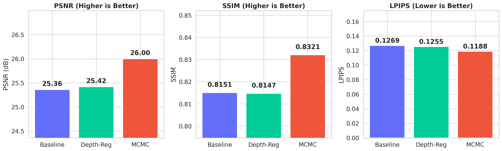

# 3D Gaussian Splatting with Depth Regularization

A comprehensive study of 3D Gaussian Splatting (3DGS) variants for novel view synthesis, comparing **baseline densification**, **monocular depth regularization**, and **MCMC-based stochastic densification** on the Mip-NeRF 360 benchmark.

Built on [gsplat](https://github.com/nerfstudio-project/gsplat) — a memory-efficient, fully-fused CUDA implementation of 3DGS rasterization.

## Key Results

Evaluated on the **Mip-NeRF 360 Garden** scene (24 held-out test views):

| Method | PSNR (dB) | SSIM | LPIPS | Gaussians | Train Time |
|--------|-----------|------|-------|-----------|------------|
| Baseline (Default Strategy) | 25.36 | 0.8151 | 0.1269 | 9.86M | 32.0 min |
| + Depth Regularization | 25.42 | 0.8147 | 0.1255 | 9.80M | 31.6 min |
| **MCMC Strategy** | **26.00** | **0.8321** | **0.1188** | **3.00M** | **13.8 min** |

> MCMC achieves the best quality across all metrics while using **3.3x fewer Gaussians** and training **2.3x faster** than the baseline.

### Visual Comparison

<p align="center">
  
</p>

<p align="center">
  
</p>

<p align="center">
  
</p>

## Architecture

```
┌─────────────────────────────────────────────────────────────────────┐
│                    3D Gaussian Splatting Pipeline                    │
├─────────────────────────────────────────────────────────────────────┤
│                                                                     │
│  ┌──────────────┐    ┌──────────────┐    ┌────────────────────┐    │
│  │  COLMAP SfM   │───▶│  Point Cloud  │───▶│  Gaussian Init     │    │
│  │  Reconstruction│    │  (138K pts)   │    │  means, scales,    │    │
│  │  cameras.bin   │    │  + RGB colors │    │  quats, opacity,   │    │
│  │  images.bin    │    │               │    │  SH coefficients   │    │
│  │  points3D.bin  │    └──────────────┘    └────────┬───────────┘    │
│  └──────────────┘                                   │               │
│                                                     ▼               │
│  ┌──────────────────────────────────────────────────────────┐      │
│  │              Differentiable Rasterization                 │      │
│  │  ┌─────────────────────────────────────────────────────┐  │      │
│  │  │  gsplat.rasterization (fully-fused CUDA)            │  │      │
│  │  │  • Tile-based sorting + alpha compositing           │  │      │
│  │  │  • Spherical harmonics → view-dependent color       │  │      │
│  │  │  • RGB+D render mode (color + depth in one pass)    │  │      │
│  │  └─────────────────────────────────────────────────────┘  │      │
│  └───────────────────────────┬──────────────────────────────┘      │
│                              │                                      │
│                              ▼                                      │
│  ┌──────────────────────────────────────────────────────────┐      │
│  │                     Loss Function                         │      │
│  │  L_total = (1-λ_ssim) · L1 + λ_ssim · (1 - SSIM)       │      │
│  │          + λ_depth · L_depth(disparity)    [optional]     │      │
│  └───────────────────────────┬──────────────────────────────┘      │
│                              │                                      │
│                              ▼                                      │
│  ┌──────────────────────────────────────────────────────────┐      │
│  │              Densification Strategy                       │      │
│  │                                                           │      │
│  │  Default:  Split large Gaussians, clone high-gradient     │      │
│  │            ones, prune low-opacity. Reset periodically.   │      │
│  │                                                           │      │
│  │  MCMC:     Stochastic birth-death process. Relocate dead  │      │
│  │            Gaussians to high-gradient regions. Inject      │      │
│  │            position noise for exploration. Cap at N_max.   │      │
│  │                                                           │      │
│  │  Depth:    Default + disparity-space loss against          │      │
│  │            Depth Anything V2 monocular priors.             │      │
│  └──────────────────────────────────────────────────────────┘      │
│                                                                     │
└─────────────────────────────────────────────────────────────────────┘
```

## Method Details

### Baseline (Default Strategy)
Standard 3DGS with adaptive density control: Gaussians with high 2D gradients are cloned (small) or split (large), and those with opacity below threshold are pruned. Opacity is periodically reset to encourage pruning of unnecessary Gaussians.

### Depth Regularization
Adds a monocular depth prior from **Depth Anything V2** (Small). Depth maps are pre-computed for all training views and used as supervision in disparity space:

```
L_depth = |1/d_rendered - s·(1/d_prior) - t|
```

where `s` and `t` are per-image scale and shift computed via least-squares alignment. This resolves the scale ambiguity of monocular depth while providing geometric guidance.

### MCMC Strategy
Treats Gaussian densification as a stochastic sampling problem ([Kheradmand et al., 2024](https://ubc-vision.github.io/3dgs-mcmc/)). Key differences from the default:
- **Relocation**: Dead Gaussians (low opacity) are teleported to high-loss regions instead of being pruned
- **Stochastic perturbation**: Position noise is injected proportional to learning rate, enabling exploration of the loss landscape
- **Fixed budget**: Maintains a maximum Gaussian count (3M), forcing efficient allocation of representational capacity

## Project Structure

```
3dgs-depth-regularized/
├── configs/
│   └── default.yaml              # Full training configuration
├── scripts/
│   ├── train.py                  # Training (baseline/depth/mcmc modes)
│   ├── evaluate.py               # PSNR/SSIM/LPIPS evaluation
│   ├── visualize.py              # Generate comparison plots
│   └── download_data.py          # Download Mip-NeRF 360 dataset
├── src/gaussian_depth/
│   ├── data/
│   │   ├── colmap.py             # Scene parser (Parser, Dataset)
│   │   ├── colmap_reader.py      # Custom COLMAP binary reader
│   │   └── normalize.py          # Camera normalization utilities
│   └── utils/
│       └── config.py             # Configuration loading
├── data/360_v2/garden/           # Mip-NeRF 360 garden scene
├── checkpoints/                  # Trained model checkpoints
├── results/                      # Evaluation metrics & visualizations
└── logs/                         # Training logs
```

## Quick Start

### Prerequisites
- NVIDIA GPU with CUDA support (tested on RTX 4090, 24GB VRAM)
- Conda package manager

### Installation

```bash
# Clone the repository
git clone https://github.com/A-SHOJAEI/3dgs-depth-regularized.git
cd 3dgs-depth-regularized

# Create conda environment
conda create -n gs3d python=3.11 -y
conda activate gs3d

# Install PyTorch with CUDA
pip install torch torchvision --index-url https://download.pytorch.org/whl/cu124

# Install gsplat and dependencies
pip install gsplat>=1.5.0
pip install -r requirements.txt
```

### Download Data

```bash
python scripts/download_data.py --scene garden
```

Downloads the Mip-NeRF 360 garden scene (~2.9 GB) with COLMAP reconstructions.

### Training

```bash
# Train all three variants sequentially
python scripts/train.py --mode all

# Or train individual variants
python scripts/train.py --mode baseline
python scripts/train.py --mode depth
python scripts/train.py --mode mcmc
```

### Evaluation

```bash
python scripts/evaluate.py --checkpoints \
  "baseline:checkpoints/<baseline_dir>/final.pt" \
  "depth_reg:checkpoints/<depth_dir>/final.pt" \
  "mcmc:checkpoints/<mcmc_dir>/final.pt"
```

### Visualization

```bash
python scripts/visualize.py
```

Generates `metrics_comparison.png`, `training_curves.png`, and `render_comparison.png` in `results/`.

## Technical Details

### Gaussian Representation
Each Gaussian is parameterized by:
- **Position** (mean): 3D center point
- **Covariance**: Factored as rotation quaternion (4D) + log-scale (3D)
- **Opacity**: Sigmoid-activated scalar
- **Color**: Spherical harmonics coefficients (degree 0-3, 48 parameters per Gaussian)

### Training Configuration
| Parameter | Value |
|-----------|-------|
| Max steps | 30,000 |
| Image loss | 0.8 * L1 + 0.2 * (1 - SSIM) |
| Depth loss weight | 0.01 (depth variant only) |
| Learning rate (means) | 1.6e-4 |
| SH degree | 3 (progressive, +1 every 1000 steps) |
| Densification interval | Every 100 steps (500-15000) |
| MCMC Gaussian cap | 3,000,000 |
| MCMC noise LR | 5000 |

### Hardware
- **GPU**: NVIDIA RTX 4090 (24 GB VRAM)
- **RAM**: 32 GB
- **Training time**: 14-32 minutes per variant

## Analysis

### Why MCMC Outperforms

The MCMC strategy's superiority stems from three key mechanisms:

1. **Efficient allocation**: By capping Gaussians at 3M and relocating dead ones to high-loss regions, MCMC avoids the "Gaussian bloat" that plagues default densification (9.8M+ Gaussians, many redundant).

2. **Stochastic exploration**: Position noise prevents the optimization from getting trapped in local minima, particularly important for complex outdoor scenes like Garden with thin structures (flowers, leaves).

3. **Better convergence**: The fixed budget forces the optimizer to find a more compact, expressive representation rather than relying on brute-force coverage.

### Depth Regularization Effect
The depth prior provides a modest improvement (+0.06 dB PSNR, -0.001 LPIPS) over the baseline. The effect is subtle because:
- The Garden scene has strong multi-view overlap, providing sufficient geometric signal from photometric loss alone
- Monocular depth has inherent scale ambiguity requiring per-image alignment
- The depth loss weight (0.01) is intentionally conservative to avoid degrading photometric quality

Depth regularization shows larger gains in sparse-view settings or scenes with textureless regions.

## References

- Kerbl et al., [3D Gaussian Splatting for Real-Time Radiance Field Rendering](https://repo-sam.inria.fr/fungraph/3d-gaussian-splatting/), SIGGRAPH 2023
- Kheradmand et al., [3D Gaussian Splatting as Markov Chain Monte Carlo](https://ubc-vision.github.io/3dgs-mcmc/), NeurIPS 2024
- Yang et al., [Depth Anything V2](https://depth-anything-v2.github.io/), NeurIPS 2024
- Ye et al., [gsplat: An Open-Source Library for Gaussian Splatting](https://docs.gsplat.studio/), 2024
- Barron et al., [Mip-NeRF 360: Unbounded Anti-Aliased Neural Radiance Fields](https://jonbarron.info/mipnerf360/), CVPR 2022

## License

MIT License — see [LICENSE](LICENSE) for details.
